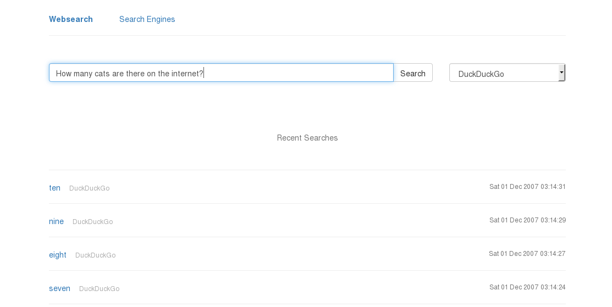
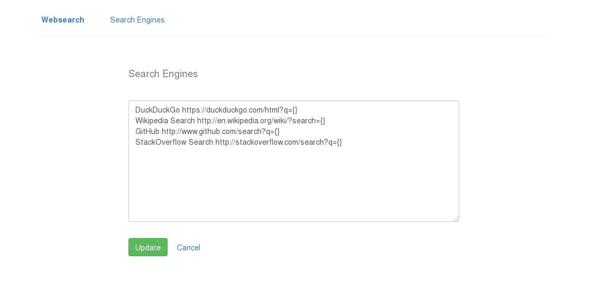

# Websearch

This web application allows you to select from a list of easily configurable websites and search it while keeping a record of all your recent searches.

Doesn't sound like much, right?

Well, the nifty bits lie in the whole process.

You can have instant access to this search page however you like:

- put it in a pinned tab
- bookmark it
- open it with every new blank tab
- open it in a dedicated browser window
- open it from outside the browser (keyboard shortcut, desktop icon, panel icon, ...)
- ...

The search box focusses automatically.

The list of recent searches can be searched using the browser's built-in search functionality. Every recent search link is clickable so it can be repeated without much typing.

Search engines can be configured by simply adding a URL to the list on the "Search Engines" page. Note that the search term itself is represented as `{}`. The position of a search engine in the search engines list determines its position in the dropdown. The first one is the default search engine.

All of this, without JavaScript!

Usage:

```
python main.py
```




